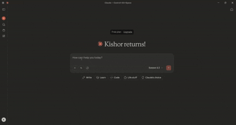

# GitHub MCP Server — Issue Triage + PR Summarizer

Model Context Protocol (MCP) server that connects to GitHub for lightweight triage and review support. It exposes tools to list repositories, search issues/PRs, label and close issues, and generate PR summaries using Gemini.

<p align="center">
  
</p>

## Features
- list_repos: list repositories for the authenticated user (first page)
- search_issues: GitHub search (issues and PRs) via `q` query
- label_issue: add one or more labels to an issue
- close_issue: close an issue by number
- summarize_pr: summarize a PR (intent, risks, breaking changes, test plan) using Gemini

## Requirements
- Node.js 18+
- GitHub Personal Access Token (fine‑grained or classic)
  - Scopes/permissions: Metadata: Read, Contents: Read, Issues: Read & Write, Pull requests: Read
- Gemini API key (Google AI Studio)
- Windows (tested) — works on macOS/Linux as well

## Install
```
npm install
npm run build
```

Create a `.env` file:
```
GITHUB_TOKEN=your_github_pat
GEMINI_API_KEY=your_gemini_key
# Optional, defaults to gemini-2.0-flash
GEMINI_MODEL=gemini-2.0-flash
```

## Run with MCP Inspector (optional)
```
npx @modelcontextprotocol/inspector
# In UI: STDIO → Command: node → Args: D:/Project_2/github-mcp-server/dist/index.js
```

## Use with Claude Desktop
Add to `%APPDATA%/Claude/claude_desktop_config.json`:
```
{
  "mcpServers": {
    "github-triage-mcp": {
      "command": "node",
      "args": ["D:/Project_2/github-mcp-server/dist/index.js"],
      "transport": "stdio",
      "env": {
        "GITHUB_TOKEN": "YOUR_PAT",
        "GEMINI_API_KEY": "YOUR_GEMINI_KEY",
        "GEMINI_MODEL": "gemini-2.0-flash"
      }
    }
  }
}
```
Restart Claude Desktop and enable `github-triage-mcp` in the side panel.

Screenshots:
- Claude: MCP server enabled — `demo/mcpserverenabledinclaudeesktop.png`
- Tool list in Claude — `demo/claudedesktoptoollist.png`
- list_repos result — `demo/listallrepo.png`
- summarize_pr output — `demo/prsummarize.png`
- Issue actions — `demo/issues.png`

## Example tool calls (Inspector or Claude)
```jsonc
// search_issues
{ "q": "repo:Kishor1291292/datawise_ai is:issue is:open", "perPage": 10 }

// label_issue
{ "owner": "Kishor1291292", "repo": "datawise_ai", "number": 123, "labels": ["triage"] }

// close_issue
{ "owner": "Kishor1291292", "repo": "datawise_ai", "number": 124 }

// summarize_pr
{ "owner": "Kishor1291292", "repo": "datawise_ai", "number": 1 }
```

## Security
- Do NOT commit `.env` or tokens.
- Fine‑grained PAT recommended. Remove or rotate tokens after demos.

## License
MIT
